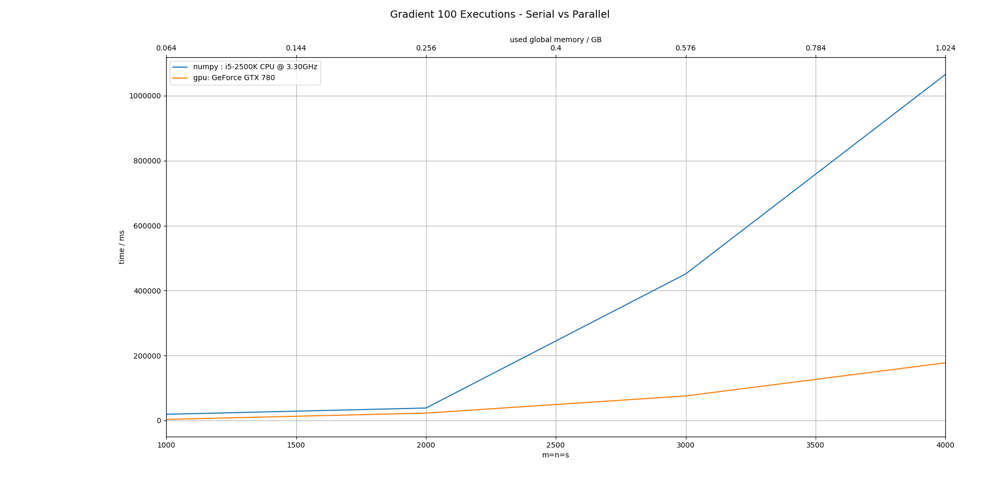
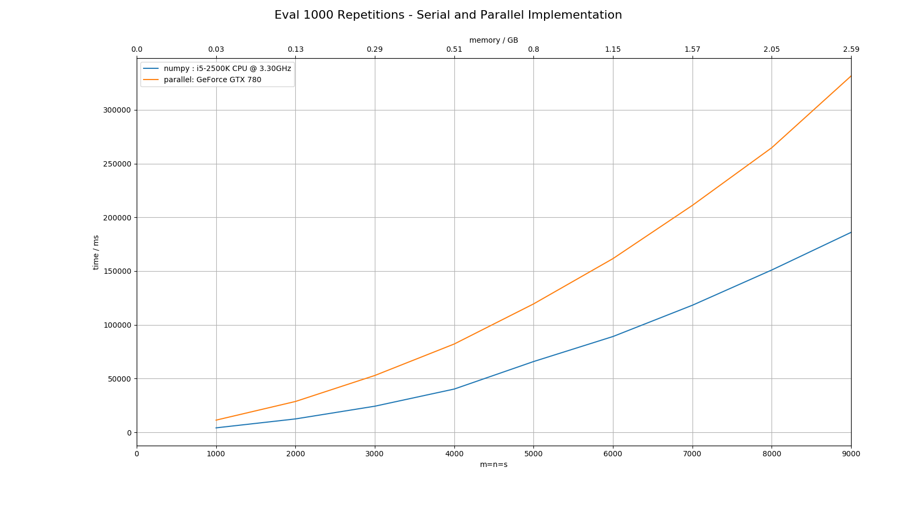

# ABS-NF
A python and CUDA/C++ implementation of the following operations to deal with picewise linear functions in abs-normal form:

 * Evaluate
 * Gradient
 * Solve

 Theory: https://arxiv.org/abs/1701.00753

## Results

### Gradient: CPU vs GPU 

### Eval CPU vs GPU 
